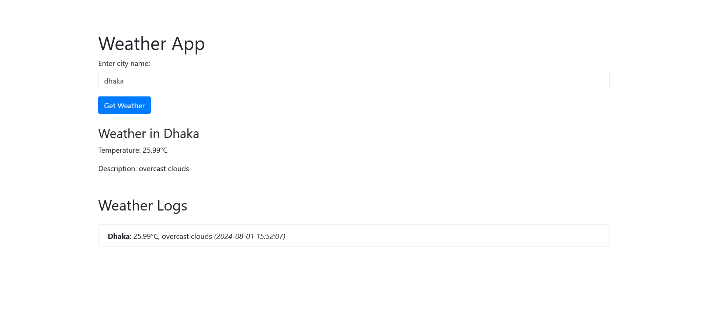

# Simple Weather App
A weather application that fetches and displays weather information from an API using PHP, jQuery, AJAX, Bootstrap, CSS, and MySQL.



### Install Process

1. **Clone the repository:**
   ```sh
   git clone https://github.com/your-username/simple-weather-app.git
   cd simple-weather-app
   ```

2. **Set up the database:**
    - Create a database named `weather_app`.
    - Import the provided SQL file (`database/database.sql`) to set up the necessary tables.
    - Import the provided SQL file to set up the necessary tables.
    ```sh
      mysql -u yourusername -p weather_app < database.sql
    ```

3. **Configure the application:**
    - Copy `config.sample.php` to `config.php`:
      ```sh
      cp config.sample.php config.php
      ```
    - Open `config.php` and update the database configuration and API key details.

4. **Run the application:**
    - Serve the application using your local web server or PHP's built-in server:
      ```sh
      php -S localhost:8000
      ```

5. **Access the application:**
    - Open your browser and navigate to `http://localhost:8000`.

### File Structure

Here’s a basic file structure for your simple-weather-app application:

```
simple-weather-app/
│
├── config.sample.php
├── index.html
├── database.sql
├── src/
│   ├── api.php
│   └── fetch_weather.php
├── css/
│   └── styles.css
├── js/
│   └── script.js
├── README.md
└── .gitignore
